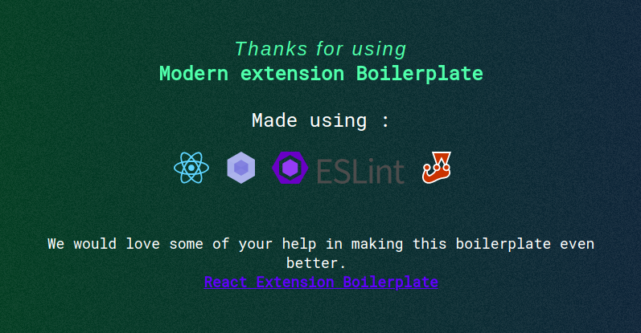

# Kite OPTION Strategy Calculation Extension Boilerplate for Chrome and Firefox


## Installation :checkered_flag:

Installing this boilerplate is as simple as cloning this repo in a new folder and start editing the source folder.

*Before you begin installing this project you need [**NodeJS**](https://nodejs.org/en/) and [**npm**](https://www.npmjs.com/get-npm) installed on your machine. Make sure to install the latest version of node.*

```bash
# clone the git repo
$ git clone https://github.com/saurshaz/option-strategy-calc.git

# Install dependencies
$ npm install
```

## Development :computer:

* Run script
```bash
# build files to './dev' 
# and launches the web ext in a new chrome instance, watches for changes and updates
$ npm run start:chrome
# launches in firefox
$ npm run start:firefox
# runs storybook
$ npm run storybook
```
*`npm run chrome-launch` in action:*


* If you want to load your unpacked extension by yourself, then run `npm run dev`. This will create the extension inside an **dev** folder in `development` mode and will watch the `src` folder for changes.   
* [Load unpacked extensions](https://developer.chrome.com/extensions/getstarted#unpacked) with `./dev` folder. Though you have to reload the extension by yourself every time the `./dev` folder updates.

*Screenshot of the development folder:*
<br/>


**Go to the project folder and run the following commands:** 

## How to develop extension using the boilerplate

The [CODETOUR.md](CODETOUR.md) gives an overview of the project structure.
<br/>
The only folder important to you is the **source folder**. The [`/src`](src) contains the different components of the extension like **content_scripts, background, options, popup, sidebar**. 

Any component which you not require, suppose you don't need *sidebar*, you can simply delete that component from the src folder and it will not be included inside your build.

### If you don't want to use React..

Suppose you don't want to use React in your [popup](src/popup) to develop UI. You can delete all the files inside the popup folder **only leaving** the [**`template.html`**] inside it. <br/>
You can use this `template.html` as your `popup.html`. **BUT** any scripts or CSS files referenced inside this template.html should be put inside the `src/lib` folder.<br/>
### Storing static assets like images, fonts

Separate folders have been provided to store these static assets. 
* `/src/img`
* `/src/fonts`
  
These assets are copied as it is to the build folder, just like the `/src/lib` folder.

## Build :wrench: :hammer:

```bash
# build files to './extension'
$ npm run build
```
*Once created here's what the extension folder looks like:*
<br/>


## Compress :nut_and_bolt: 

```bash
# compress build folder to {manifest.name}.zip and crx
$ npm run build
$ npm run compress -- [options]
```

#### Options

If you want to build `crx` file (auto update), please provide options, and add `update.xml` file url in [manifest.json](https://developer.chrome.com/extensions/autoupdate#update_url manifest.json).

* --app-id: your extension id (can be get it when you first release extension)
* --key: your private key path (default: './key.pem')  
  you can use `npm run compress-keygen` to generate private key `./key.pem`
* --codebase: your `crx` file url

See [autoupdate guide](https://developer.chrome.com/extensions/autoupdate) for more information.

## Features

## Contributing :tada:

To get an idea about the structure of the project, [read here](CODETOUR.md).
Contributions are highly welcome. Please take some time to read the guidelines mentioned here [contribute](CONTRIBUTING.md).

<div align="center">
  
</div>

## License

The code is available under the [MIT license](LICENSE).
